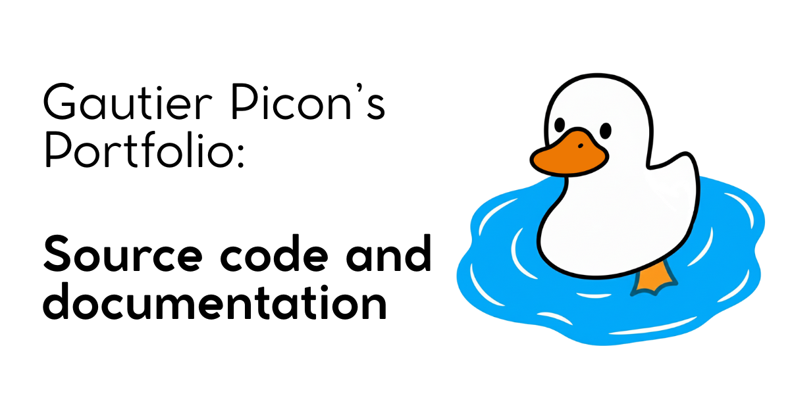

[](https://gautierpicon.com)

# My Portfolio [](LICENSE.md)

My personal protfolio. Have fun !!
[gautierpicon.com](https://gautierpicon.com)

## Additional Documentation

For more details on the backend or frontend, see the associated readme.md files.

- [Backend README](https://github.com/Gautierpicon/Portfolio/tree/main/backend)
- [Frontend README](https://github.com/Gautierpicon/Portfolio/tree/main/frontend)
- [Model README](https://github.com/Gautierpicon/GP-Portfolio/tree/main/ollama)

## Feedback

Feedback are welcome! Feel free to open an [issue](https://github.com/Gautierpicon/GP-Portfolio/issues) or a [pull request](https://github.com/Gautierpicon/GP-Portfolio/pulls) on the GitHub repository.

## Tech Stack

**Client:** Bun, Astro, Svelte, TailwindCSS

**Server:** FastAPI (Python)

**Hosting:** backend: selfhost // Frontend: Vercel

## Features

Chat with the AI and find out who I am, my background, the tools I'm proficient in, and much more. Feel free to ask any questions you may have. I've provided the AI with enough context about myself for it to be able to answer your questions and even provide useful links. 

## Operating Diagram

```bash
┌──────────────────────┐
│  Vercel              │ ← Frontend
│                      │
└──────────┬───────────┘
           │
           │ Call my API via the Internet
           │
           ▼
┌──────────────────────┐
│  Serveur             │ ← Backend that I host
│                      │
│  ┌────────────────┐  │
│  │ FastAPI      ◀──────── The API
│  │                │  │
│  └────────┬───────┘  │
│           ▼          │
│  ┌────────────────┐  │
│  │ Ollama       ◀──────── Local AI
│  │                │  │
│  └────────────────┘  │
└──────────────────────┘
```

## Repository structure

```bash
Portfolio/
├── backend/
│   ├── main.py
│   ├── README.md
│   └── requirements.txt
│
├── frontend/
│   ├── public/
│   │   ├── favicon.svg
│   │   └── quack.mp3
│   ├── src/
│   │   ├── assets/
│   │   ├── components/
│   │   │   ├── ChatInput.svelte
│   │   │   └── ConversationView.svelte
│   │   ├── layouts/
│   │   │   └── Layout.astro
│   │   ├── pages/
│   │   │   ├── 404.astro
│   │   │   ├── chat.astro
│   │   │   ├── how-it-works.astro
│   │   │   └── index.astro
│   │   └── global.css
│   └── README.md
│
├── ollama/
│   ├── Modelfile
│   └── README.md
│
├── LICENSE.md
└── README.md
```

## Contributing

Contributions are always welcome! Here's how to download it and run it locally :

### Run Locally

#### Prerequisites:

- [Bun](https://bun.com/)
- [Python](https://www.python.org/)
- [Ollama](https://ollama.com/)

Clone the project

```bash
  git clone https://github.com/Gautierpicon/GP-Portfolio
```

Go to the project directory

```bash
  cd Portfolio
```

#### Setup Frontend:

Install dependencies

```bash
  cd frontend
```
```bash
  bun install
```

Start the server

```bash
  bun run dev
```

#### Setup Backend:

Install dependencies

```bash
  cd backend
```

```bash
  python3 -m venv venv
```

```bash
  source venv/bin/activate
```

```bash
  pip install -r requirements.txt
```

Start the server

```bash
  uvicorn main:app --reload --port 8000
```

#### Environment Variables

To run this project, you will need to add the following environment variables:

`PUBLIC_BACKEND_URL`

To do this, create a file named “.env” in the “frontend” file with the following content: 

```bash
  PUBLIC_BACKEND_URL=http://localhost:8000
```

#### Setup model

### Create the model

Navigate to the `ollama` directory containing the `Modelfile` 

```bash
cd ollama
```

And run:

```bash
ollama create DuckAI -f Modelfile
```

This command creates a new model called `DuckAI` using the specifications in your Modelfile.

Go to http://localhost:4321/ to use the website.